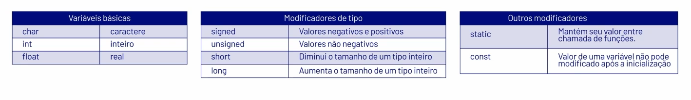

# Introdução a Linguagem C

# Revisão Lógica de Programação

<aside>
💡

Dados de entrada → Processamento → Saída

</aside>

- Constantes → não alteram o valor durante o programa;

# A Linguagem C

- Linguagem de baixo nível;
- Portabilidade;
- Tipagem estática → o tipo da variável precisa ser declara antes de sua utilização;
- Case Sensitive → distingue maiúsculas e minúsculas;
- Ponteiros → manipulação direta da memória

# Estrutura Básica de um Programa em C

<aside>
🚨

Main → ponto de entrada do programa.

Bibliotecas → fornecem ferramentas.

</aside>

### Variável → armazenamento de dados em um programa



- Sintaxe 1: `tipo_variavel nome_variavel ;`
- Sintaxe 2: `<modificador> tipo_variavel nome_variavel ;`
    
    
    

### Bibliotecas → conjunto de funções pré-definidas


`#include <nome da biblioteca>`


### Entrada e Saída


**Operadores:** 

- Aritméticos → cálculos matemáticos simples;
- Atribuição → atribui valor a uma variável;
- Incremento e decremento → autoexplicativo;
- Lógicos e Relacionais → importantes nas decisões do algoritmo;


# Comandos de Controle

### If e Else


```c
#include <stdio.h>

int main() {
    float nota1, nota2, nota3, media;

    // Lendo as notas do aluno
    printf("Digite a primeira nota: ");
    scanf("%f", &nota1);

    printf("Digite a segunda nota: ");
    scanf("%f", &nota2);

    printf("Digite a terceira nota: ");
    scanf("%f", &nota3);

    // Calculando a média
    media = (nota1 + nota2 + nota3) / 3;

    // Verificando a situação do aluno
    if (media >= 7) {
        printf("Aprovado! Média: %.2f\n", media);
    } else if (media >= 5) {
        printf("Recuperação! Média: %.2f\n", media);
    } else {
        printf("Reprovado! Média: %.2f\n", media);
    }

    return 0;
}
```

### Switch


```c
#include <stdio.h>

int main() {
    int valor = 2;

    switch (valor) {
        case 1:
            printf("Um\n");
            break;
        case 2:
            printf("Dois\n");
            break;
        case 3:
            printf("Três\n");
            break;
        default:
            printf("Valor inválido\n");
    }
    return 0;
}
```

### While


```c
#include <stdio.h>

int main() {
    int numero, soma = 0; // Inicialização

    printf("Digite números. Digite 0 para parar.\n");

    while (numero != 0) { // condição
        printf("Digite um número: ");
        scanf("%d", &numero);
        soma += numero; // incremento
    }

    printf("A soma dos números é: %d\n", soma);

    return 0;
}
```

- Diferença entre while e do-while
    - No do-while, o código será executado pelo menos uma vez;

### For


```c
#include <stdio.h>

int main() {
    int numero, soma = 0; 

    printf("Digite o número limite: ");
    scanf("%d", &numero);

    for (int i = 1; i <= numero; i++) { 
        soma += i;
    }

    printf("A soma dos números de 1 até %d é: %d\n", numero, soma);

    return 0;
}

```

# Funções e Parâmetros

```c
#include <stdio.h>

// Função para calcular a média
float calcular_media(float nota1, float nota2) {
    return (nota1 + nota2) / 2;
}

// Função para verificar se o aluno foi aprovado
void verificar_aprovacao(float media) {
    if (media >= 7.0) {
        printf("Aprovado! Média: %.2f\n", media);
    } else {
        printf("Reprovado! Média: %.2f\n", media);
    }
}

int main() {
    float nota1, nota2, media;

    printf("Digite a primeira nota: ");
    scanf("%f", &nota1);

    printf("Digite a segunda nota: ");
    scanf("%f", &nota2);

    // Chamando a função para calcular a média
    media = calcular_media(nota1, nota2);

    // Chamando a função para verificar a aprovação
    verificar_aprovacao(media);

    return 0;
}
```

- Modularidade;
- Reusabilidade;
- Manutenção;
- Legibilidade