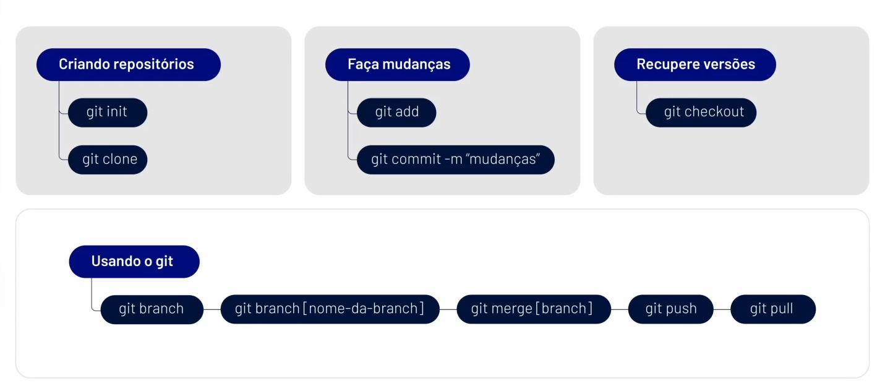

# Depuração e Versionamento

# Depuração

<aside>
❗

Técnica para identificar e corrigir erros no código

</aside>

- Estabilidade;
- Manutenção;
- Funcionabilidade;

### Ferramentas de depuração

- Execução passo a passo do código;
- Monitoramento de variáveis;
- Recursos avançados;

# Versionamento

<aside>
❗

Acompanha e gerencia mudanças no código.

</aside>

- Colaboração;
- Rastreamento de mudanças;
- Recuperação de versões.

## Git

<aside>
❗

Sistema de controle de versão

</aside>

### Branches

<aside>
❗

Linha independente de desenvolvimento

</aside>

- Várias pessoas trabalhando paralelamente no mesmo código.

<aside>
🚨

**Merge:** combina duas branches em uma única.

</aside>