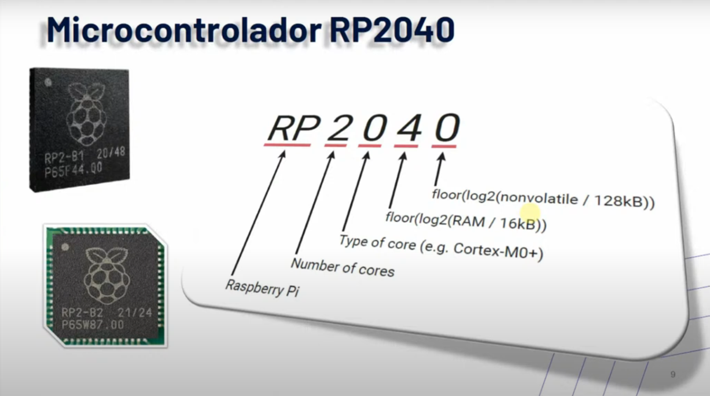

# Introdução ao Desenvolvimento de Software Embarcado com Microcontroladores

# Introdução

- Recursos limitados;
- Programação em Baixo Nível;
- Controle preciso de tempo;
- Interação com o mundo físico;

### Pontos de Atenção de Desafios

- Gerenciamento de energia
- Otimização de código;
- Depuração e testes;

# Kit de Desenvolvimento

### Componentes

- Raspberry Pi Pico W;
- Bateria;
- Display OLED;
- Matriz de LEDs coloridos;
- Microfone;
- Joystick;
- Botões;
- Buzzer;
- Conectores de expansão.

## Raspberry Pi Pico W

- Baixo custo e flexível;
- RP2040
    - Alta performance;
    - Baixo custo;
    - Fácil de usar;
    - Rico conjunto de periféricos.
- Possui interfaces de comunicação sem fio;
- Porta micro USB;
- Interface de depuração SWD;
- SDK simples;